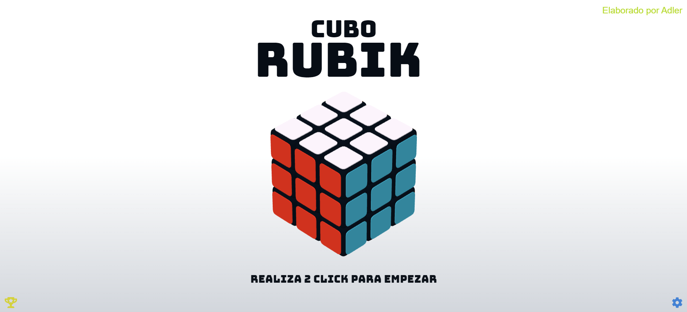
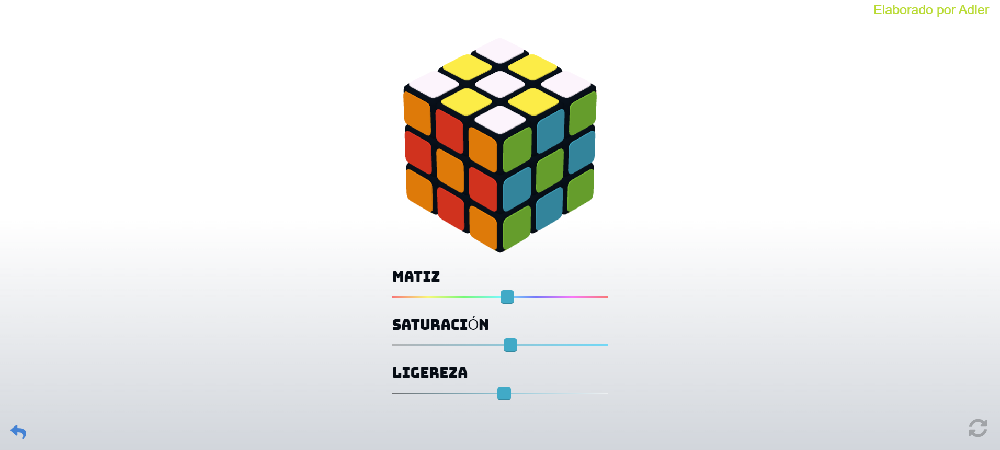
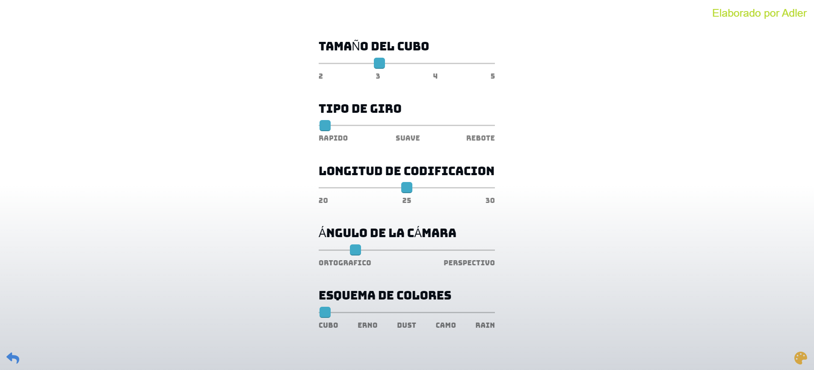

# CuboRubik
Esta proyecto esta diseñado para interactuar con un cubo para resolverlo a través de la web , en cual se tendrá que usar habilidades para llegar a la solución .
Asimismo se podra aumentar la dificultad y se guardaran los logros que esta pueda hacer vistas por el usuario y ver su progreso en cuanto al tiempo que dure en resolverlo
 https://adlerb57.github.io/CuboRubik/

